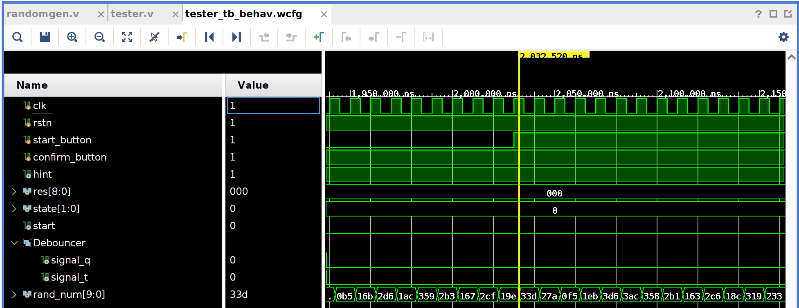

# ReactionTester
本仓库是2024学年复旦微电子学院专用集成电路设计的大作业项目

## 设计规划
### 设计要求
设计一个人体反应测试仪，两个按键代表启动（START）和反应（CONFIRM）按键。START按键表示开始测试，CONFIRM按键表示测试者按下反应按键。在测试者按下START按键后，经过随机时间(此项目中设置为4s-8s不等)，系统提示测试者按下反映按键，系统给出测试人的反应时间。输出结果采用UART的形式发送给上位机。

### 设计思路
硬件的功能板块主要由状态机、随机数生成器、按键消抖、计数器等模块构成。除此以外，为了使用UART读出数据，将硬件部分封装为IP外设，采用AXI4-Lite总线协议挂载在ZYNQ A9硬核SoC上。通过访问该外设来获取测试结果。

### 设计说明
1. 设计平台

| FPGA板卡 | 黑金Alinx Zynq XC7Z020-CLG484-2 |
| FPGA架构 | 可编程逻辑部分采用Xilinx Artix-7，处理器采用Arm Cortex-A9双核SoC |
| IDE环境 | 可编程逻辑部分采用Vivado 2022.2，嵌入式部分采用Vitis 2022.2 |

2. 设计流程图


## 设计实现

### 框图介绍

### 各模块设计与验证
篇幅所限，仅展示核心部分的模块设计文件：
1. 顶层文件，包含状态机、计数器与信号生成的功能模块：
```Verilog
module tester #(
    parameter FREQ = 50_000_000,
    parameter MAX_DELAY = 512, // unit: ms
    parameter MAX_SCALE = 8    // unit: s
  ) (
    input clk,
    input rstn,
    input start_button,
    input confirm_button,
    output reg hint,
    output reg [$clog2(MAX_DELAY) - 1 : 0] res,
    output wire irq,
    output reg [1:0] valid
  );
  wire [9:0] rand_num_w;
  wire start;
  wire confirm;

  randomgen randomgen_u (
              .clk(clk),
              .rstn(rstn),
              .rand_num(rand_num_w)
            );

  reg [$clog2(MAX_SCALE) + 10 - 1:0] rand_num;
  always@(posedge clk or negedge rstn)
  begin
    if(!rstn)
      rand_num <= 0;
    else if(start)
      rand_num <= rand_num_w * 4 + 4096;
  end

  debouncer u1 (
              .clk(clk),
              .rstn(rstn),
              .button(start_button),
              .signal(start)
            );

  debouncer u2 (
              .clk(clk),
              .rstn(rstn),
              .button(confirm_button),
              .signal(confirm)
            );

  localparam IDLE = 2'b00, START = 2'b01, TEST = 2'b10, FINISH = 2'b11;
  reg [1:0] state, next_state;

  // Generate a counter & a timer
  reg [$clog2(FREQ) - 1:0] counter;
  reg [$clog2(MAX_SCALE) + 10 - 1:0] timer;
  reg hint_q;
  always@(posedge clk or negedge rstn)
  begin
    if(!rstn || state == IDLE || state == FINISH || (!hint & hint_q))
    begin
      counter <= 0;
      timer <= 0;
    end
    else if(state == START || state == TEST)
    begin
      counter <= counter + 1;
      if(counter == FREQ / 1000)
      begin
        counter <= 0;
        timer <= timer + 1;
      end
    end
  end

  localparam LEGAL = 2'b00, EARLY = 2'b01, LATE = 2'b10;
  // Generate Outputs
  always@(posedge clk or negedge rstn)
  begin
    if(!rstn)
    begin
      hint <= 1;
      hint_q <= 1;
      res <= 0;
      valid <= LEGAL;
    end
    else
    begin
      hint_q <= hint;
      if(state == START)
      begin
        if(timer == rand_num)
          hint <= 0;
        if(confirm)
          valid <= EARLY;
      end
      if(state == TEST)
      begin
        if(confirm)
        begin
          if (timer[$clog2(MAX_DELAY) - 1 : 0] >= 100)
            res <= timer[$clog2(MAX_DELAY) - 1 : 0];
          else
            valid <= EARLY;
        end
        else if(timer[$clog2(MAX_DELAY) - 1 : 0] == 511)
          valid <= LATE;
      end
    end
  end

  // State Machine

  always@(posedge clk or negedge rstn)
  begin
    if(!rstn)
      state <= IDLE;
    else
      state <= next_state;
  end

  always@(*)
  begin
    case(state)
      IDLE:
      begin
        if(start)
          next_state = START;
        else
          next_state = IDLE;
      end
      START:
      begin
        if(timer == rand_num)
          next_state = TEST;
        else if(confirm)
          next_state = FINISH;
        else
          next_state = START;
      end
      TEST:
      begin
        if(confirm)
          next_state = FINISH;
        else
          next_state = TEST;
      end
      FINISH:
      begin
        if(start)
          next_state = START;
        else
          next_state = FINISH;
      end
      default:
        next_state = IDLE;
    endcase
  end

  // IRQ generation
  reg s_irq;
  always@(posedge clk) s_irq <= |res;
  assign irq = |res & !s_irq | valid[0];

endmodule

```
2. 按键消抖模块：
```Verilog
`timescale 1ns / 1ps
`define DELAY_LENGTH 500// Macro for max allowed delay. Unit: us

module debouncer #(
    parameter FREQ = 100_000_000
  ) (
    input clk,
    input rstn,
    input button,
    output signal
  );

  reg signal_q;
  reg signal_t;
  reg [$clog2(`DELAY_LENGTH * FREQ / 1_000_000) - 1 : 0] counter;
  always @(posedge clk or negedge rstn)
  begin
    if(!rstn || button)
      counter <= 0;
    else if(counter < FREQ * `DELAY_LENGTH / 1_000_000)
      counter <= counter + 1;
  end

  always @(posedge clk or negedge rstn)
  begin
    if(!rstn || button) begin
      signal_t <= 0;
      signal_q <= 0;
    end
    else if(counter == FREQ * `DELAY_LENGTH / 1_000_000)
    begin
      signal_t <= 1'b1;
      signal_q <= signal_t;
    end
  end
  assign signal = signal_t & !signal_q;
endmodule
```

3. 随机数生成模块，使用的是10阶LFSR随机数生成算法：
```Verilog
module randomgen (
    input clk,
    input rstn,
    output reg [9:0] rand_num
  );
  always @(posedge clk or negedge rstn)
  begin
    if(!rstn)
    begin
      rand_num <= 1;
    end
    else
    begin
      rand_num[9] <= rand_num[8];
      rand_num[8] <= rand_num[7];
      rand_num[7] <= rand_num[6];
      rand_num[6] <= rand_num[5];
      rand_num[5] <= rand_num[4];
      rand_num[4] <= rand_num[3];
      rand_num[3] <= rand_num[2];
      rand_num[2] <= rand_num[1];
      rand_num[1] <= rand_num[0];
      rand_num[0] <= rand_num[2] ^ rand_num[9];
    end
  end
endmodule
```

### 仿真验证
1. 顶层测试文件：
```Verilog
`timescale 1ns / 1ps
module tester_tb;

//Ports
reg  clk;
reg  rstn;
reg  start_button;
reg  confirm_button;
wire  hint;
wire [8 : 0] res;

tester #(
  .FREQ(1000)
) tester_inst (
  .clk(clk),
  .rstn(rstn),
  .start_button(start_button),
  .confirm_button(confirm_button),
  .hint(hint),
  .res(res)
);

always #5  clk = ! clk ;
initial begin
  clk = 1;
  rstn = 1;
  start_button = 1;
  confirm_button = 1;
  #10 rstn = 0;
  #10 rstn = 1;
  start_button = 0;
  #2010 start_button = 1;
  #19010 confirm_button = 0;
  #2010 confirm_button = 1;
  #10 start_button = 0;
  #2010 start_button = 1;
end

endmodule
```
2. 随机数生成测试文件
```Verilog
`timescale 1ns / 1ps
module randomgen_tb;

  // Parameters

  //Ports
  reg  clk;
  reg  rstn;
  wire [9:0] rand_num;

  randomgen  randomgen_inst (
               .clk(clk),
               .rstn(rstn),
               .rand_num(rand_num)
             );

  always #5  clk = ! clk ;
  initial begin
    clk = 1;
    rstn = 1;
    #10 rstn = 0;
    #10 rstn = 1;
    #15000 $finish;
  end
  
  always@(posedge clk) begin
    if(rand_num == 1) begin
      $display("Hit! Time: %0t", $time);
    end
  end
endmodule
```

3. 仿真与测试结果
功能仿真结果如下：


时序仿真结果如下：


ILA捕获信号结果如下：


### 综合与实现
实现后的系统时序如下：


系统功耗如下：


## 设计总结
### 注意事项与编程技巧
1. 在不确定上板行为的Bug位置时，可以采用ILA逻辑分析仪抓取相关信号，以便更好定义问题。
2. 需要关注板卡中LED与Switch输入的Spec，输入输出的行为对于的信号高低定义可能与直觉相反。必要时需要查看FPGA制造商公开的PCB Layout设计图。

### 体会心得
本项目巩固了一些Verilog的设计经验和技巧，同时通过嵌入式系统部分的设计，熟悉了软硬件协同的设计方法和路径，也进一步学习了ZYNQ板卡的一些使用方法。

## 附录
**Coding Style Reference**: https://github.com/lowRISC/style-guides/blob/master/VerilogCodingStyle.md
